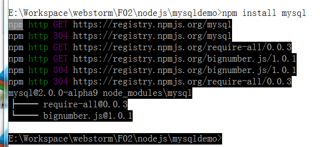

# nodejs 链接mysql
--------------------------

## nodejs 核心模块没有mysql模块，需要第三方模块。
   1. 为node.js安装mysql模块使用node.js中的npm管理器。
   2. cmd，进入你的项目的路径。
   3. 在命令行输入 npm install mysql 之后npm会自动为你下载Mysql模块默认放在你的项目路径下。下载完成后会生成node_modules的目录。里面是什么暂时可以不用去管理。
   以下是示意图 
	
	
   以上都是准备工作，下面介绍怎么使用mysql 模块
## 使用mysql 模块建立链接，查询数据
	`
	/* 加载mysql 模块，如果控制台报 不能找到mysql模块，
 	   你的mysql模块没有成功下载或者是路径不对
   	 */
	var mysql = require('mysql');

	var TEST_DATABASE = 'crm';

	var TEST_TABLE = 'city';

	 //创建连接
	var connection = mysql.createConnection({
	    host : 'localhost',
	    user : 'root',
	    password : 'root'
	});

	connection.query("USE "+TEST_DATABASE);

	//查询，并设置回调函数
	connection.query(
	    'SELECT * FROM '+TEST_TABLE,
	    function selectCb(err, results, fields) {
	        // 不用说也知道 results 返回来的结果，
	        // 可以通过debug 知道返回来的结果数据集是什么，存放对象的数组
	        // 数组就遍历，获得每个对象就可以键名得到相应的值。
	        for(var i in results){
	            console.log(results[i].c_name);
	        }
	       // 链接结束
	        connection.end();
	    }
	);

	`

 以上是一个简单的demo , 第三方mysql 模块可以参考github 提供开源的项目 [https://github.com/felixge/node-mysql](https://github.com/felixge/node-mysql)